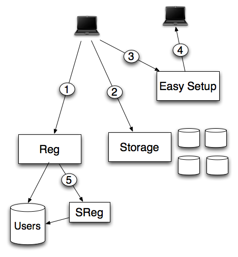

.. _overview:

========================
Overview of the services
========================

* 1) Firefox Sync registers a new user using the :ref:`reg` server.
* 2) Firefox Sync or Firefox Home interacts with a :ref:`server_storage` server.
* 3) & 4) Firefox Sync uses :ref:`ezsetup` to transfer a user profile.
* 5) Internally, Mozilla Corp uses :ref:`sreg` to defer writes to a secured server.

